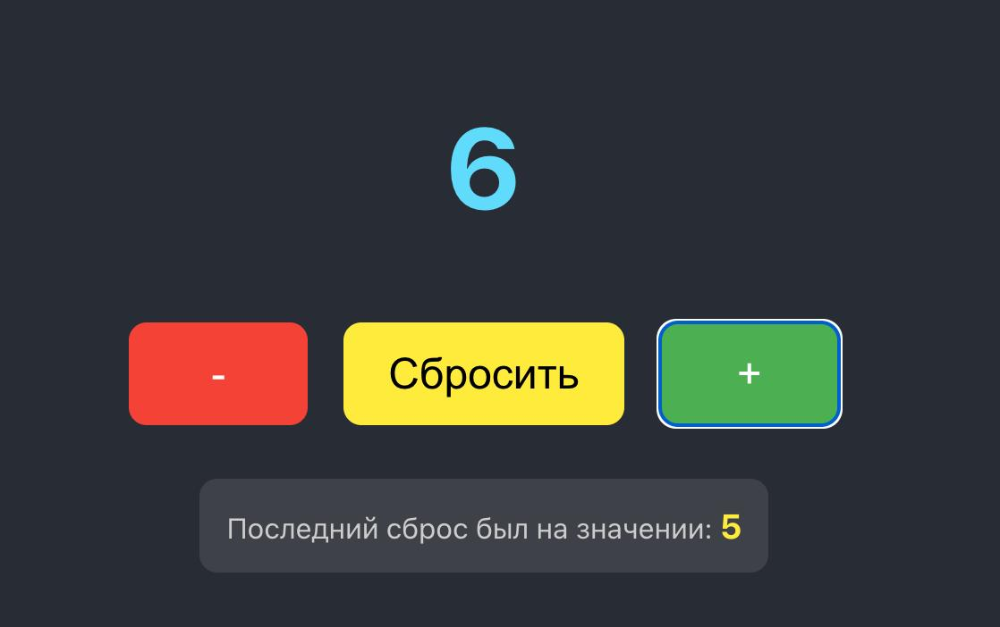

# Счётчик кликов

Простое React-приложение - счётчик кликов, созданное в рамках контрольной работы.

## Функционал

- Увеличение значения счётчика
- Уменьшение значения счётчика
- Сброс значения к нулю
- Оображение последнего сброшенного значения

## Технологии

- React
- React Hooks (useState)
- CSS3

## Скриншоты приложения

